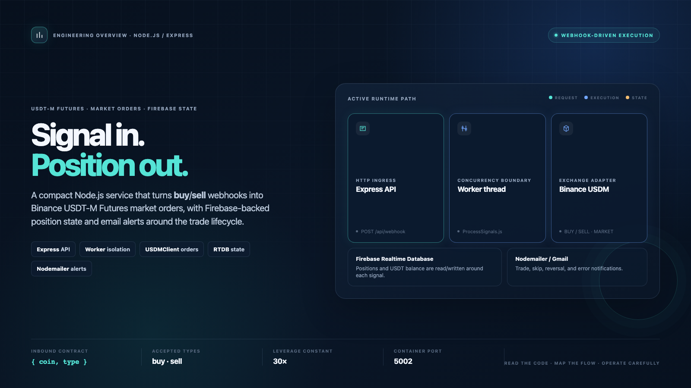
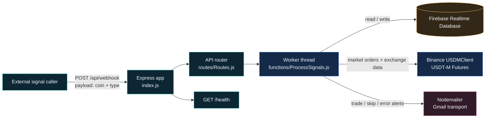
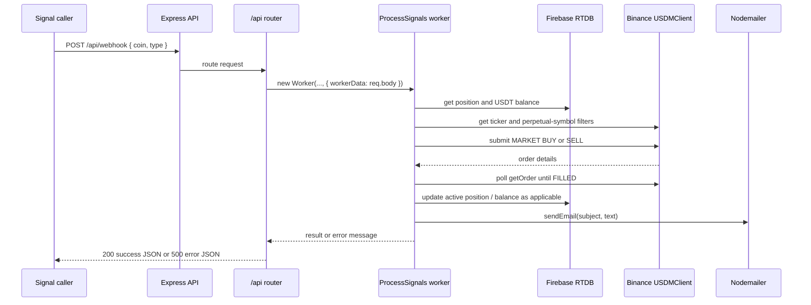
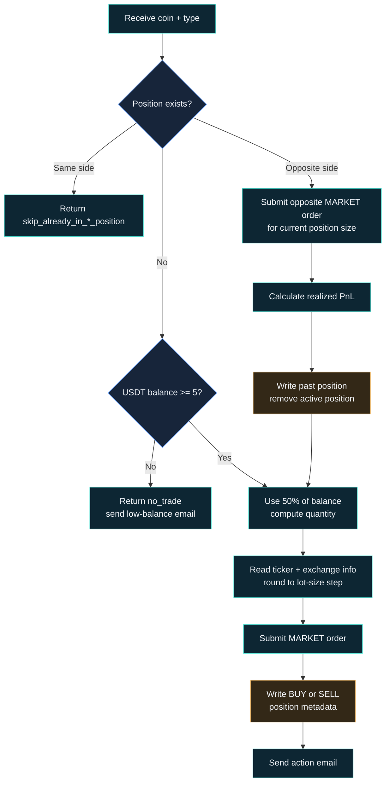

# Binance USDT-Futures Trading Bot

Webhook-driven Node.js service that turns `buy`/`sell` signals into Binance USDT-M Futures market orders, while keeping position state in Firebase Realtime Database and sending email notifications through Nodemailer.

> **Implementation boundary:** This README describes the active code path. The current worker switch handles only lowercase `buy` and `sell`. Older comments and working notes mention eight signal names and technical-indicator validation, but those branches are not active in `functions/ProcessSignals.js`.

## Key capabilities

| Capability | What the code actually does |
| --- | --- |
| HTTP ingress | Express accepts JSON and URL-encoded bodies up to 10 MB, mounts the router at `/api`, and exposes `/health`. |
| Isolated processing | `POST /api/webhook` creates a Node.js `Worker` for `functions/ProcessSignals.js`, passing the request body as `workerData`. |
| Market execution | The worker uses `USDMClient` from the `binance` package to submit `MARKET` BUY/SELL orders and polls until `FILLED` (up to five attempts, one second apart by default). |
| Position transitions | A same-side signal is skipped; an opposite-side signal closes the current position, records realized PnL, archives it, then opens the requested side. |
| State and alerts | Firebase RTDB stores position/balance data; Nodemailer sends trade, skip, reversal, and error notifications. |
| Quantity sizing | The active constant is `LEVERAGE = 30`; quantity sizing uses the current ticker, perpetual-symbol metadata, quantity precision, and lot-size filters. |

## High-Level Architecture



## Detailed System Flows

### Webhook request and worker lifecycle



### Current `buy` / `sell` position lifecycle



### HTTP contract

| Method | Path | Behavior |
| --- | --- | --- |
| `GET` | `/` | Returns `Hello from bentolink :D`. |
| `GET` | `/health` | Returns `200 OK` with body `OK`. |
| `GET` | `/api/test` | Returns a static router test message. |
| `POST` | `/api/webhook` | Runs the worker with `req.body`; returns `{ success: true, result }` or `{ success: false, error }`. |

The active webhook payload is shaped like:

```json
{
  "coin": "BTCUSDT",
  "type": "buy"
}
```

`coin` is normalized by taking the portion before the first `.`. The active switch recognizes `buy` and `sell`; other values return an `Unknown type` result.

## Key Components

| File | Responsibility |
| --- | --- |
| [`index.js`](./index.js) | Loads environment variables, configures CORS/body parsing, mounts `/api`, defines `/` and `/health`, and listens on `PORT` or `5002`. |
| [`routes/Routes.js`](./routes/Routes.js) | Defines the test/webhook routes and wraps worker messages, worker errors, and non-zero exits in a Promise. |
| [`functions/ProcessSignals.js`](./functions/ProcessSignals.js) | Worker entrypoint; reads state, computes quantity, submits and confirms orders, updates position state, calculates reversal PnL, and sends email notifications. |
| [`client.js`](./client.js) | Initializes the Firebase client SDK and exports the Realtime Database handle used by the worker. |
| [`dockerfile`](./dockerfile) | Defines Node 22-slim development/production stages, installs system libraries, copies the app, and exposes port `5002`. |
| [`package.json`](./package.json) | Declares the ESM package, start/dev/test scripts, and runtime dependencies. |

## State model

The current worker uses these Firebase paths:

| Purpose | Path in active code | Fields / behavior |
| --- | --- | --- |
| Active position | `/positions/<coin>` | Reads existing state; writes `side`, `size`, `entryPrice`, `leverage`, `capitalAllocated`, `openedAt`, and `updatedAt` for new/reversed positions. |
| USDT balance | `/balance/usdt` | Read by the worker; `updateUsdtBalance()` writes through `/balance`. |
| Archived position | `atheeb/pastPositions/<coin>/<timestamp>` | Receives the closed position plus `exitPrice`, `realizedPnL`, and `closedAt`; the active `/positions/<coin>` node is then removed. |

> **Review note:** The active position and balance helpers use root-level `/positions` and `/balance` paths, while the archive helper writes under `atheeb/pastPositions`. That path split is present in the source and should be resolved before relying on historical-position reads.

> **Balance nuance:** The entry and reversal branches calculate a `newBal`, but their calls to `updateUsdtBalance(newBal)` are commented out. The balance helper exists, but those active branches do not currently persist the calculated delta.

## Tech Stack

| Layer | Repository evidence |
| --- | --- |
| Runtime | Node.js ESM (`"type": "module"`); the Docker base image is `node:22-slim`. |
| HTTP | Express `4.21.2`, `body-parser`, and `cors`. |
| Concurrency | Node.js `worker_threads`. |
| Exchange | `binance` `^2.15.2`, using `USDMClient`. |
| Persistence | Firebase client SDK `^11.1.0`, using Realtime Database APIs. |
| Notifications | Nodemailer `^6.9.16`, configured for Gmail in the active worker. |
| Quantity/indicator dependencies | `technicalindicators` is imported, but ADX/ATR/RSI are not called by the active `buy`/`sell` branches. |
| Packaging | Multi-stage Dockerfile with development and production targets; both start `node index.js`. |

The manifest also declares other packages—such as `axios`, `binance-api-node`, `firebase-admin`, `googleapis`, `node-binance-api`, and `trading-indicator`—that are not imported by the active request path.

## Operational constants and limits

There are no checked-in performance, profitability, or reliability metrics. The useful code-backed constants are:

| Constant | Value | Source |
| --- | ---: | --- |
| Default HTTP port | `5002` | [`index.js`](./index.js) |
| JSON / URL-encoded body limit | `10mb` | [`index.js`](./index.js) |
| Leverage used by quantity sizing | `30×` | [`functions/ProcessSignals.js`](./functions/ProcessSignals.js) |
| Minimum balance gate | `5` USDT | [`functions/ProcessSignals.js`](./functions/ProcessSignals.js) |
| Order-fill polling | `5` attempts, `1000 ms` delay | [`functions/ProcessSignals.js`](./functions/ProcessSignals.js) |

## Repository Structure

```text
.
├── index.js                  # Express bootstrap and health endpoint
├── routes/
│   └── Routes.js             # /api/test and /api/webhook
├── functions/
│   └── ProcessSignals.js     # Worker-based trade processor
├── client.js                 # Firebase app + Realtime Database handle
├── testFunctions/
│   └── getbal.js             # Commented-out balance probe
├── docs/assets/
│   ├── readme-hero.html      # Standalone hero source
│   └── readme-hero.png       # Rendered README hero
├── dockerfile                # Node 22-slim multi-stage image
├── package.json              # Manifest and scripts
├── package-lock.json         # Locked dependency graph
├── dump .js                  # Historical implementation fragment
├── howitworks.txt            # Historical behavior notes
└── latestfix.txt             # Historical change notes
```

## Setup and Usage

### Configure prerequisites

1. Use Node.js compatible with the `node:22-slim` container base, or use the provided Dockerfile.
2. Install dependencies with `npm install`.
3. Provide `PORT`, `BINANCE_API_KEY`, and `BINANCE_API_SECRET` through the environment. The worker reads the Binance credentials from `process.env`.
4. Populate the empty `firebaseConfig` object in [`client.js`](./client.js) for the Firebase project that owns the Realtime Database.
5. Configure the blank Gmail/Nodemailer auth and sender/recipient fields in [`functions/ProcessSignals.js`](./functions/ProcessSignals.js) if email notifications are required. Keep credentials outside source control.

The repository does not include a `.env.example`, Firebase schema file, or checked-in secret configuration. Do not copy credentials from historical notes into the repository.

### Run locally

```bash
npm install
npm start
```

The service listens on `http://localhost:5002` by default, unless `PORT` is set.

### Run with Docker

```bash
docker build -f dockerfile -t usdt-futures-trading-bot .
docker run --rm -p 5002:5002 --env-file .env usdt-futures-trading-bot
```

The Dockerfile supplies the Node runtime and OS libraries, but Firebase configuration and the active Nodemailer fields still need to be configured as described above.

### Verify the HTTP surface

These requests are derived from the registered routes; they are examples only and were not executed while preparing this README.

```bash
curl http://localhost:5002/health
curl http://localhost:5002/api/test

curl -X POST http://localhost:5002/api/webhook \
  -H 'Content-Type: application/json' \
  -d '{"coin":"BTCUSDT","type":"buy"}'
```

The webhook can place a market order when credentials, Firebase state, balance, symbol metadata, and order constraints all permit it. Treat it as trade-execution code: review leverage, permissions, quantity rules, and failure handling before using real funds.

> **Risk disclaimer:** This repository is an educational/demo codebase, not a guarantee of trading performance. Do not use real funds until the implementation, credentials, exchange permissions, state paths, and failure modes have been independently reviewed and tested.

## Repository Notes

- [`howitworks.txt`](./howitworks.txt) and [`latestfix.txt`](./latestfix.txt) are historical working notes. They describe earlier signal names, validation ideas, and data paths that do not all match the active worker.
- [`dump .js`](./dump%20.js) is an unimported historical implementation fragment; it is not part of the runtime graph.
- The package manifest declares the `ISC` license. No `LICENSE` file is present in the repository.
- `npm test` is a placeholder script that exits with `Error: no test specified`; no automated test suite is configured.
